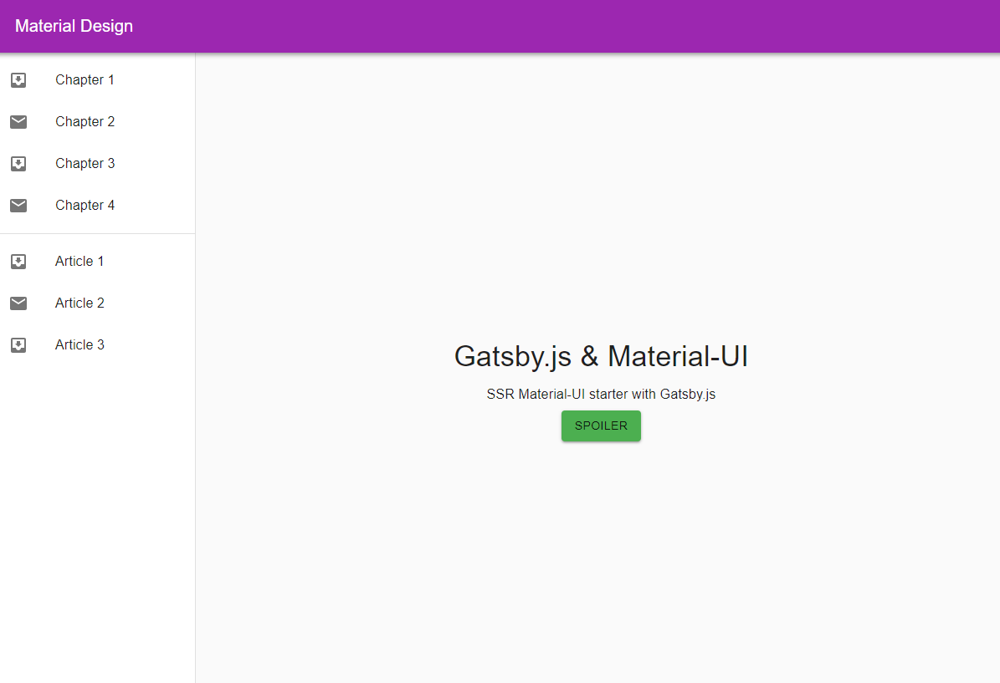

# Gatsby Material UI Starter

## How to use

Download the example [or clone the repo](https://github.com/mpolinowski/material-ui-gatsby-render-starter)

Install it and run:

```bash
npm install gatsby-cli
npm install
npm run develop
```


You can access the hot reloading DEV environment on _http://localhost:8000_. To build your static site run:

```bash
npm run build
gatsby serve
```

You can access the build page on  _http://localhost:9000_.

__Attention__: _gatsby serve_ seems to be broken in Gatsby v2. You can copy the content from the __./public__ folder into your webservers public directory to be served. Alternatively, you can use [httpster](https://simbco.github.io/httpster/) to test serve your build.




## The idea behind the example

[Material UI](https://material-ui-next.com/) are React components that implement Google's Material Design.
[Gatsby](https://github.com/gatsbyjs/gatsby) is a static site generator for React.
